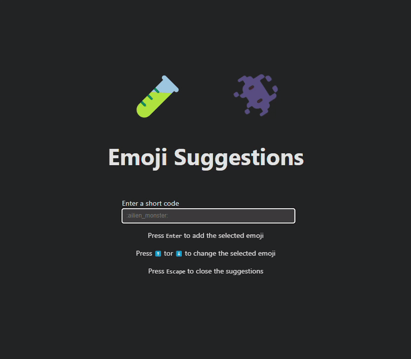

# Emoji Suggestions

## Install 

```
npm i @T0ASTMalone/emoji-suggestions

# or 

yarn add @T0ASTMalone/emoji-suggestions
```

## Preview


## Usage 
```tsx 
import React, { useState, useRef } from 'react';
import { EmojiSuggestions } from '@T0ASTMalone/emoji-suggestions';

function CustomInput() {
  const [value, setValue] = useState<string>('');
  const ref = useRef<HTMLInputElement>(null);

  const handleChange = (e: React.ChangeEvent<HTMLInputElement>) => {
    setValue(e.target.value);
  };

  return (
    <>
      <EmojiSuggestions
        value={value}
        inputRef={ref}
        updateValue={setValue}
      />
      <label>
        Message
        <input 
          ref={ref}
          value={value}
          onChange={handleChange}
        />
      </label>
    </>
  )
}

```

